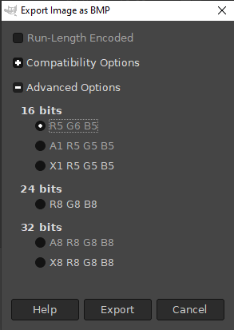

# StarlinkFob_Peplink_v3

## Contents
- [Misc](#misc)
  - [x] [1. Comments](#1-comments)
  - [x] [2. Debug logs](#2-debug-logs)
  - [x] [3. Logic flow](#3-logic-flow)
  - [x] [4. Guide to adding new menus](#4-guide-to-adding-new-menus)
  - [x] [5. Primary and secondary Wi-Fi](#5-primary-and-secondary-wi-fi)
- [Core features](#core-features)
  - [x] [1. Use asynchronous delays](#1-use-asynchronous-delays)
  - [x] [2. Dual-core configuration](#2-dual-core-configuration)
  - [x] [3. Beep on long press only](#3-beep-on-long-press-only)
  - [4. Add button C functionality](#4-add-button-c-functionality)
  - [x] [5. Interrupts for button press detection](#5-interrupts-for-button-press-detection)
  - [x] [6. Home page rendering issue](#6-home-page-rendering-issue)
  - [x] [7. HTTP server early startup](#7-http-server-early-startup)
  - [x] [8. Startup sequence](#8-startup-sequence)
  - [x] [9. New splash screen sequence](#9-new-splash-screen-sequence)
  - [x] [10. Update time screen](#10-update-time-screen)
  - [x] [11. Add sensors screen](#11-add-sensors-screen)
  - [x] [12. Changes to Wi-Fi post-connection sequence](#12-changes-to-wi-fi-post-connection-sequence)
  - [x] [13. USB power loss detection](#13-usb-power-loss-detection)
  - [x] [14. Temperature alarm \& logging](#14-temperature-alarm--logging)
  - [x] [15. Ping screen loop over hosts](#15-ping-screen-loop-over-hosts)
- [Network](#network)
  - [1. HTTPS ignore certificate CN verification](#1-https-ignore-certificate-cn-verification)
- [Peplink](#peplink)
  - [x] [1. Loading indication](#1-loading-indication)
  - [x] [2. WAN list sort by priority](#2-wan-list-sort-by-priority)
  - [x] [3. SIM List page](#3-sim-list-page)
  - [x] [4. WAN status PAGE](#4-wan-status-page)
  - [x] [5. WAN summary page display](#5-wan-summary-page-display)
  - [x] [6. Cellular signal indicator](#6-cellular-signal-indicator)
  - [7. Add router reboot option](#7-add-router-reboot-option)

## Misc

### 1. Comments
- Comments have been added

### 2. Debug logs

```
Please add lots of comments in the code, I would like to learn from this project.
Implement debug mode that outputs a lot more output to serial, and also suppresses a lot when it's off.
```

- The following flags can be defined at the top of [`config.h`](StarlinkFob_Peplink_v3/config.h#L14) and control the printing of debug logs for different translation units:
  - `ENABLE_VERBOSE_DEBUG_LOG` - enables all debug logs
  - `PEPLINK_DEBUG_LOG` - enables debug printing for Peplink API functions
  - `UI_DEBUG_LOG` - enables debug logs for UI functions
  - `WEBSERVER_DEBUG_LOG` - enables debug logs for webserver functions

### 3. Logic flow  

```
Separately add a readme that has a simple sequence of startup/shutdown/error condition flows.
```
[`Sequence_diagrams.md`](Sequence_diagrams.md) contains the following diagrams:
- [Boot flow](Sequence_diagrams.md#boot-flow)
- [Wi-Fi loss recovery](Sequence_diagrams.md#wi-fi-loss-recovery)

### 4. Guide to adding new menus
```
Also a readme document on how to add new menus.
```

- Available in the [*Usage* section of the Minu library README](StarlinkFob_Peplink_v3/Minu/README.md#usage).

### 5. Primary and secondary Wi-Fi
```
Explain how the two wifi's work, I'm not sure I understand/it doesn't seem to work for me.
```

At first boot, when the Wi-Fi is manually enabled or upon Wi-Fi connection loss, the device first attempts
to connect to the primary SSID, counting down for 5 minutes.
- If connection is unsuccessful, an attempt is made using the secondary SSID.
- If this is also unsuccessful, the Wi-Fi disconnected page is displayed with options to retry connecting,
  start the AP or cancel Wi-Fi setup.
- Upon retry, connection to the primary SSID is attempted, followed by the secondary SSID as aforementioned

## Core features

### 1. Use asynchronous delays

```
Change all delay() to millis(), code should still be executing for getting connected to wifi , pinging hosts, logging into router ,fetching json, parsing json, regardless of how long we want to displaying a screen.
```

- `delay()`s are only used in the splash screen, when waiting for Wi-Fi to switch modes and when waiting for the ui to be updated.
During the splash screen, it is necessary to wait because the next screen is a countdown screen and both cannot be displayed at the same time. Other than during the splash screen, there are upto 5 separate threads running concurrently, meaning that if a delay is requested in one thread all the rest will continue performing without interruption.

### 2. Dual-core configuration

```
How can we use the second core for fetching json, or utilize pinned tasks?
```

- In ESP32 terminology, the two CPU cores are called App(User application) CPU and Pro(Background process) CPU. I'm pinning all tasks to run on the App CPU because the Pro CPU is designated for critical processes such as Wi-Fi and networking and it is therefore recommended to avoid using it for user applications.

Also, using the Pro CPU. to fetch JSON does not offer any performance improvements since we'd still have to idle-wait for the JSON to be fetched and parsed before we can proceed to display on  the App CPU.

But to answer the question, utilizing the second core is just a matter of changing which core a task is pinned to upon creation. The Update task does all the json fetching and parsing so this would be the task to pin.

### 3. Beep on long press only

```
Play beep when detecting long press A(M5), should be heard before having to release the button.
Play beep when detecting long press B (different tone), should be heard before having to release the button.
This will help with the user knowing how long to hold button.
No tone for short press.
```

- Button A long press beeps at 9KHz for 50ms
- Button B long press beeps at 7KHz for 50ms


### 4. Add button C functionality

```
Add detection of button c , short press via interrupt.
https://community.m5stack.com/topic/3722/m5stickc-plus-detect-power-button-momentary-press
If you can get detection of button C to work, make sure press go back a menu, regardless of the currently selected item.
```

### 5. Interrupts for button press detection

```
Should all buttons be detected via interrupts?
```

- The API does not expose any function to find out how long a button has been pressed until it is released. So to achieve the requested beep-on-long-press functionality, interrupts are necessary to provide flexibility in handling and it should be possible to use them on all buttons
- The use of interrupts for user inputs causes frequent interruption to the scheduling of tasks, causing the device to crash. Thus the use of interrupts is infeasible.

### 6. Home page rendering issue

```
On home page the selected item does not invert white background , black text like it does on other screens.
```

### 7. HTTP server early startup
```
HTTP server doesn't seem to be running when on ping screen, seems like it starts when logging into router, can you check?
```
The HTTP server is started as soon as Wi-Fi ism connected in either AP or STA mode

### 8. Startup sequence
```
Startup sequence (define/show me how to add change the sequence of screens)
```

There is no straightforward way to implement the changing of screens, since specific conditions must be met before the page changes.
The startup sequence of screens to be displayed corresponding conditions is defined manually at each step;
- On boot, the `menuInit()` function is called to initialise the menu and child pages, and to
  start UI tasks.
- `menuInit()` calls `startWiFiConnectCountdown()` to initiate the connection to Wi-Fi
- Within the Wi-Fi connection countdown, three possible conditions may terminate the countdown
  1.  Successful connection - if booting, the HTTP server is started then we proceed to the ping targets page
```c
void countdownTask(void *arg)
...
      else if (fob.booting)
      {  
        M5.Lcd.clear();
        M5.Lcd.setCursor(0, cursorY);
        M5.Lcd.printf(" Connected to WiFi:\n %s\n", (fob.wifi.usePrimarySsid) ? fob.wifi.ssidStaPrimary.c_str() : fob.wifi.ssidStaSecondary.c_str());
        vTaskDelay(2000);
        if(!fob.servers.started)
        {
          fob.servers.started = true;
          Serial.println("Starting HTTP Server");
          startHttpServer();
        }
        goToPingTargetsPage();
        xTaskNotify(fob.tasks.wifiWatch, 1, eSetValueWithOverwrite);
      }
```
	- and if not booting, we return to the page before the Wi-Fi loss recovery was initiated
```c
void countdownTask(void *arg)
...
      else
      {  
        M5.Lcd.clear();
        M5.Lcd.setCursor(0, cursorY);
        M5.Lcd.printf(" Connected to WiFi:\n %s\n", (fob.wifi.usePrimarySsid) ? fob.wifi.ssidStaPrimary.c_str() : fob.wifi.ssidStaSecondary.c_str());
        vTaskDelay(2000);
        fob.menu.goToPage(lastVisitedPageId);
      }
```

  2. Connection timeout
     - if it was the primary SSID that timed out, we try the secondary SSID.
     - if it was the secondary SSID that timed out, Wi-Fi connection has failed so we display the Wi-Fi connection failed dialog

```c
void countdownTask(void *arg)
...
      if (fob.wifi.usePrimarySsid)
      {
        fob.wifi.usePrimarySsid = false;
        fob.menu.goToPage(lastVisitedPageId);
        xTaskNotify(fob.tasks.wifiWatch, 1, eSetValueWithOverwrite);
      }
      else
      {
        fob.wifi.timedOut = true;
        goToWiFiPromptPage();
      }
```

  3. Countdown was cancelled by the user
    - Same response as a Wi-Fi secondary SSID timeout: prompt the user

```c
void countdownTask(void *arg)
...
      if (stopCountdown)
      {
        fob.wifi.timedOut = true;
        goToWiFiPromptPage();
      }
```

- On boot, upon successful Wi-Fi connection, we enter the ping targets page that continuously loops through the ping targets
- If the router is successfully pinged, we exit the ping loop and proceed to connect to the router
```c
void dataUpdateTask(void *arg)
...
    if (updateType == UI_UPDATE_TYPE_PING && fob.booting && fob.pingTargets[0].pingOK)
    {
      fob.booting = false;
      break;
    }
```

### 9. New splash screen sequence
```
#1
GoBOX screen

#2
Splash screen (company name/number) (Display for 5 secs)
Implement company logo to replace text, comment out text if we change back.
https://www.hackster.io/tommyho/m5gfx-media-player-jpg-png-bmp-gif-ab76a9
Let us know how to convert/upload logo.
```

In [`config.h`](StarlinkFob_Peplink_v3/config.h#L25), the `USE_LOGO` flag enables the logo to be used in the splash screen. The actual logo image data is defined in [`logo.h`](StarlinkFob_Peplink_v3/logo.h#L8).

To add/generate new image data from an image file, the following tools will be necessary:
  - [GIMP](https://www.gimp.org/downloads/)
  - [File to hex converter](https://tomeko.net/online_tools/file_to_hex.php)
  
  1. Open GIMP and drag/drop the source image into it.
  2. Right click the image, 
   - Select `Image > Scale Image` and resize it as necessary
   - Select `Image > Transform > Flip Vertically`. This seems to be necessary to orient the image correctly.
  3. Use `Ctrl-Shift-E` to open the export menu
   - Choose a filename and location to export the file to ensuring the file has a `.bmp` extension.
   - Under export settings, choose `Advanced Options` and select `R5 G6 B5` then export



  4. Open the [file to hexadecimal converter](https://tomeko.net/online_tools/file_to_hex.php) and select the created file
  5. Copy the generated values into a text editor and format it as an array as follows
```c
const uint8_t img_data[] = {
	// Generated data here
};
```
  6. To display the image call the drawBitmap function of the display
```c
  M5.Lcd.drawBitmap(0,          // Image top left x-coordinate
                    5,          // Image top left y-coordinate
                    240,        // Image width
                    93,         // Image height
                    img_data,   // Array of image data
                    0);         // Background colour
```


### 10. Update time screen
```
#3
Time Screen (Display for 2 secs)
-Show current time with GMT HH:MM:SS(24hr) GMT-6
-Last PWR off: DD/MM/YY HH:MM(24hr)
-Last runtime  HHHH:MM (Length of time unit was powered on)

-Add to time menu display from home page.
-Show current time with GMT-/+ number for the current TZ
-Last PWR:     DD/MM/YY HH:MM(24hr)
-Last runtime  HHHH:MM (Length of time unit was powered on)
```

- Added last shutdown timestamps.


### 11. Add sensors screen
```
#4
Temperature And Humidity screen (Display for 2 secs)
-Show current Temperature and Humidity screen
-Show dd/mm/yy HH:MM of last triggered alarm.
-Catch exception if Temperature sensor not connected. (display no Temperature sensor, if not connected.)

-Add Temperature And Humidity menu entry from homepage, to screen same as boot menu when triggered with exit option

```

Added sensor readings page.

### 12. Changes to Wi-Fi post-connection sequence
```
#5
Wifi Countdown screen

#6
After successfully connected to Wifi
Display Connected to SSID name for 2 secs

#7 Network Check screen

#9 Wan summary screen
```
- Displays SSID of connected network

### 13. USB power loss detection
```
As needed
On shutdown or detect loss of usb power
-Display Shutting down screen with 30secs time (title no pwr shutdown)
-If power is restored, abort shutdown.
-write current date/time to eeprom when power loss was detected.
-write runtime hh:mm to eeprom when power loss was detected.
-Ensure that device powers back on when usb power is restored, after a complete shutdown.
```
- There is no hardware-provided method to detect availability of USB power so this feature cannot be implemented on the M5StickC Plus2

### 14. Temperature alarm & logging
```
Beep every 1sec when temperature exceeds 120F (Make value configurable temperature and C/F)
-Display screen temperature threshold exceeded , current temperature. (solid Red background, white text ALERT Title: Temperature threshold, current temp in large font like countdown timer.)
-Record date/time/temperature to eeprom(update date/time/temperature to eeprom as it increases)
-If a new date/time exceeds 120F, then it should overwrite the last date/time/max temperature.
Log to serial for testing as well.
```

- Added temperature alarm logging and log retrieval on boot

### 15. Ping screen loop over hosts
```
When ping screen is manually select after the power on sequence.
Ping Screen (Loop over hosts, and continue to ping while on this screen)
So if a host is red, it has a chance to change to green while watching for example.
```

- Already accomplished

## Network

### 1. HTTPS ignore certificate CN verification
```
Please enable https mode ignoring hostname.
https://www.esp32.com/viewtopic.php?t=19200
```

## Peplink

### 1. Loading indication
```
For screens that Auto refresh, display o/O, blinking . ,refresh icon or something to indicate it's loading in upper right corner of Title when it's getting json data instead of fetching or Getting WAN list.
```

- The smallest feasible loading icon (30px by 30px) has been used

### 2. WAN list sort by priority
```
Look at the json returned from the api/status.wan.connection display the wan list according to the "priority": 2 values.
If a wan has the same priority, then display them in the order based first on priority, and second on the array list.
This should re-sort the order when on the WAN summary screen.
```

- Added to the `getWanStatus()` function.

### 3. SIM List page
```
SIM LIST Page
 For SIM0 Display as SIM A, for SIM1 Display as SIM B.
 Display (Active) after the active one in the list.
 Example
 SIM A (Active)
 SIM B
 When going into the details of the sim if no sim detected display
 (No Sim Detected)
```

- Implemented with red font for `(No Sim Detected)`

### 4. WAN status PAGE

```
Wan status PAGE
 For type Cellular
 Display networktype in white text with Blue background.
 Example LTE , LTE-A , 5G should be displayed with a blue background.
 Single m5 press refreshes just this page.
 Add id to the api call to limit the retrieved data.
 status.wan.connection?id=2
 Long press exits the menu and returns to the wan list.
 
 On PeplinkAPI_WAN_Traffic speed change ["response"]["traffic"] to ["response"]["bandwidth"]
```

- Implemented with the page auto refreshing without need for user input

### 5. WAN summary page display
```
WAN summary page display
 Display networktype in white text with Blue background.
 Example LTE , LTE-A , 5G should be displayed with a blue background.
 After the type Cellular name is displayed display the active sim card.
 For SIM0 Display as SIM A, for SIM1 Display as SIM B.
 Example [color icon] Cellular A (Display A or B as white text on a Green background)
 After the first colored status icon, IF "managementOnly": true display orange square with white + in center.
 IF "managementOnly": False keep black space icon. before displaying the name of the wan.

```
- Done

### 6. Cellular signal indicator
```
Implement cell signalLevel as icon or line draw displaying cell signal level like you see on a phone. (should occupy at most two squares)
You can use TFT_GREY as the disabled signal line, and blue as the enabled line, or see what you come up with.
```

- Cellular signal indicator added as 5 separate icons each showing a different signal level. Displays on Cellular type WAN details page and WAN summary page

### 7. Add router reboot option
```
Add reboot router under router menu
implement /api/cmd.system.reboot command
Set a task to watch for router reconnect.
Add a router connection countdown page, if you have wifi, but no router connection availability, timeout 5 mins.
You can test with this router remotely.
```
