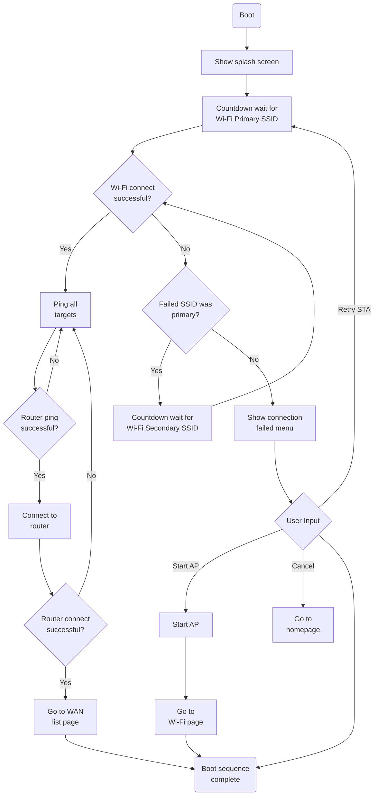
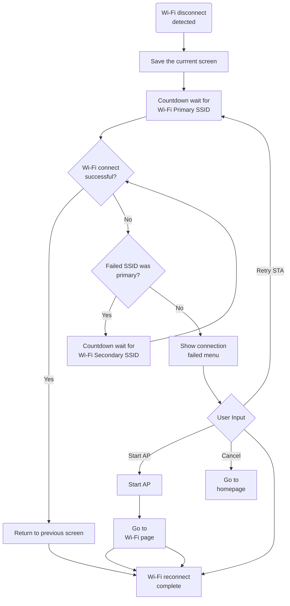

# Sequence diagrams

This file details a graphical represntation of the functional system states and processes.

**Table of Contents**
- [Sequence diagrams](#sequence-diagrams)
  - [Boot flow](#boot-flow)
  - [Wi-Fi loss recovery](#wi-fi-loss-recovery)

## Boot flow

Occurs when the device is booted.

## Wi-Fi loss recovery

Occurs when a loss in Wi-Fi connection is detected and attempts to restore it.

